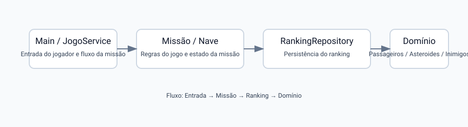

# Apostilas – SOLID (Missão Marte Unifor)

Este diretório reúne as apostilas do SOLID com exemplos do tutorial de refatoração da Missão Marte Unifor. A ideia é mostrar que o SOLID não é apenas uma teoria: ele aparece no desenho de classes, na separação de responsabilidades, na forma como a herança funciona e na maneira como a regra de negócio depende de abstrações.



## Como o projeto está organizado

No tutorial, a estrutura foi separada em camadas para deixar o desenho mais claro:

- Main: ponto de entrada da aplicação.
- service: camada de regras e fluxo do jogo.
- model: entidades do domínio, como Passageiro, Nave, Missao e Dificuldade.
- presentation: camada responsável por desenhar o mapa.
- repository: contrato e implementação de persistência do ranking.

A parte importante para a arquitetura é a seguinte:

- JogoService fica em service porque coordena a lógica do jogo.
- RankingService fica em repository porque implementa a persistência do ranking.
- JogoService depende da abstração RankingRepository, e não da implementação concreta.

Isso deixa a regra de negócio desacoplada de detalhes de infraestrutura, que é exatamente o tipo de decisão que o SOLID ajuda a formalizar.

## O problema antes da refatoração

Antes de separar as classes, é comum o projeto funcionar com uma classe central que concentra o fluxo da missão, a apresentação e a persistência:

```java
public class Main {
    public static void main(String[] args) {
        Scanner scanner = new Scanner(System.in);
        // lê comandos, move a nave e aplica as regras da missão
        // desenha o mapa no console
        // calcula a pontuação
        // grava o ranking diretamente em arquivo
    }
}
```

Esse código pode compilar e até funcionar. O problema aparece quando uma decisão muda: trocar o desenho do mapa, alterar uma regra da missão ou mudar o formato do ranking exige editar a mesma classe. Esse é o código problemático que será usado como ponto de partida nas apostilas, e não um exemplo artificial que simplesmente não compila.

## O que SOLID orienta, e o que ele não decide

SOLID não fornece uma receita única para dizer exatamente em quantas classes o código deve ser dividido. Ele indica propriedades desejáveis e perguntas para avaliar o design:

- **SRP:** quais motivos diferentes fazem essa classe mudar?
- **OCP:** uma nova variação exige editar um código estável?
- **LSP:** uma implementação substituta preserva o contrato da base?
- **ISP:** o cliente depende de operações que não utiliza?
- **DIP:** a regra de negócio conhece detalhes concretos de infraestrutura?

Depois de identificar o problema, a solução pode usar composição, polimorfismo, interfaces ou uma classe auxiliar. A escolha concreta depende do domínio da Missão Marte e deve ser justificada pelo ganho de coesão, baixo acoplamento e facilidade de evolução.

## Os princípios e seus arquivos

- SRP – Single Responsibility Principle: Responsabilidade Única (arquivo: SOLID-SRP.md)
- OCP – Open-Closed Principle: Aberto/Fechado (arquivo: SOLID-OCP.md)
- LSP – Liskov Substitution Principle: Substituição de Liskov (arquivo: SOLID-LSP.md)
- ISP – Interface Segregation Principle: Segregação de Interface (arquivo: SOLID-ISP.md)
- DIP – Dependency Inversion Principle: Inversão de Dependência (arquivo: SOLID-DIP.md)

## Sequência recomendada de estudo

1. Comece pelo SRP para perceber que as classes precisam ter um único motivo para mudar.
2. Em seguida, veja OCP para entender como ampliar o sistema sem reescrever o que já funciona.
3. Depois, estude LSP para confirmar que subclasses podem substituir a classe base.
4. Continue com ISP para evitar interfaces inchadas.
5. Finalize com DIP para reduzir acoplamento e facilitar a troca de infraestrutura.

Em cada arquivo, leia primeiro o **anti-exemplo** ou o **exemplo problemático**, depois a análise do princípio e por fim uma refatoração possível. A intenção não é decorar uma estrutura de pastas, mas aprender a reconhecer o problema que justifica a separação.

## Reflexão geral

No tutorial, cada princípio aparece em uma decisão de design:

- SRP: separa jogo, apresentação e persistência.
- OCP: permite adicionar tipos de passageiros ou regras sem mexer no código principal.
- LSP: garante que subclasses como Professor e Engenheiro funcionam onde o tipo base é esperado.
- ISP: evita que uma interface exija operações que o cliente não usa.
- DIP: mantém JogoService dependente de abstrações, e não de um detalhe de implementação.

## Referências úteis

- Projeto exemplo do tutorial: src/tutorial-exercicio10
- Apostila principal de OO: apostila_oo_java_projeto_arquitetura.md
- UML e C4: UML-Cheat-Sheet.md, C4-guidelines.md
